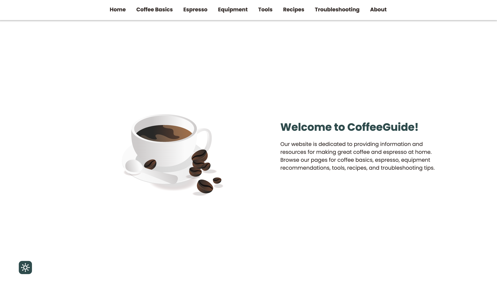

# CoffeeGuide

Hosted [here](https://khanxmo.github.io/CoffeeGuide/)!

CoffeeGuide is a simple, yet elegantly designed, website developed using HTML, CSS, and JavaScript. This website serves as a comprehensive guide for coffee lovers around the world, sharing key insights about coffee basics, making espresso, trying new recipes, choosing the right equipment, and troubleshooting.

Developed as one of the first projects during the journey to become a full-stack developer, CoffeeGuide also includes some interactive features like a calculator for optimal dosages and output for four common types of espresso drinks, a knowledge-testing coffee quiz, and a dark mode switch for a user-friendly interface. The website is fully responsive, ensuring an optimal user experience across all devices.

  

## Features
- Informative guide covering coffee basics, espresso making, recipes, equipment buying, and troubleshooting.
- An espresso calculator to optimize dosage and output for four common types of espresso drinks.
- Interactive coffee quiz to test your coffee knowledge.
- Dark mode switch for a customizable user experience.
- Scroll progress bar to track reading progress.
- Fully responsive design ensuring optimal display on mobile devices.

## Usage
Navigate through different sections to explore various aspects of coffee. Use the espresso calculator to experiment with different espresso drinks, and take the coffee quiz to test your knowledge about coffee.

Please note, this website is designed to provide a comprehensive guide to coffee lovers and enthusiasts, and may not cover advanced or professional techniques.

## Acknowledgments
W3Schools
MDN Web Docs
